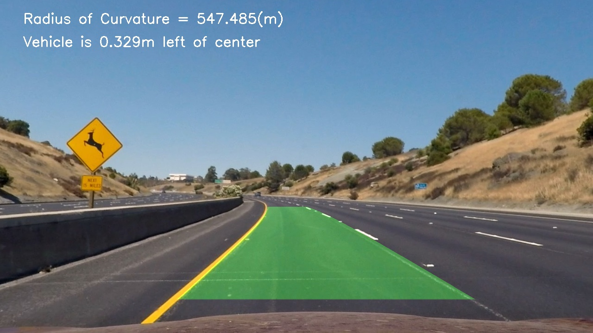
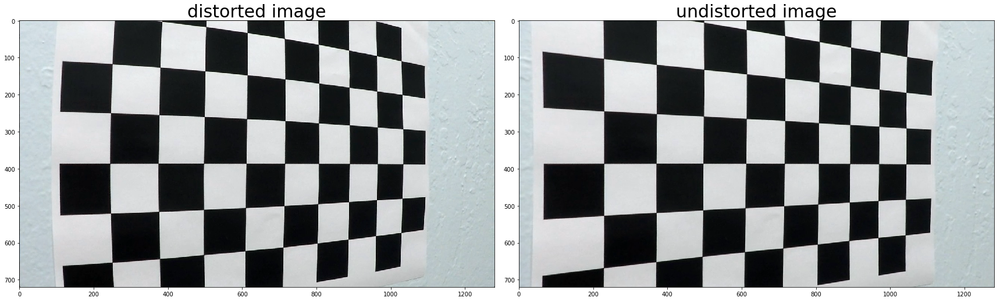
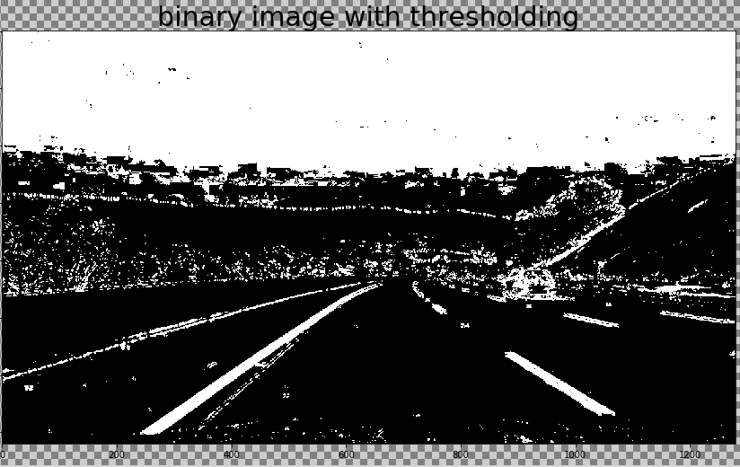
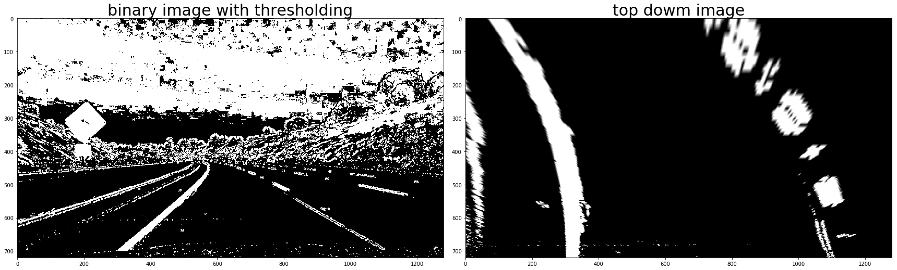
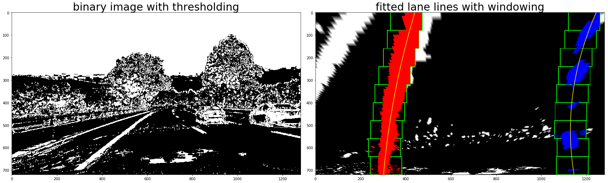
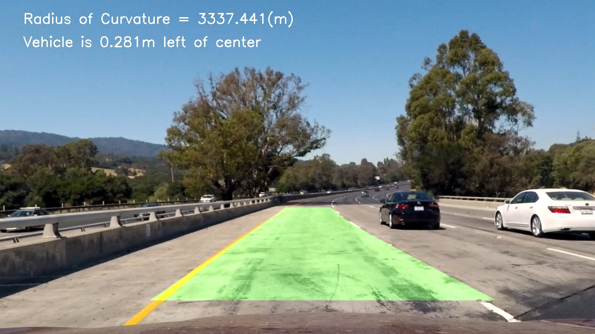

## Advanced Lane Finding

In this project, the goal is to write a software pipeline to identify the lane boundaries in a video or a series of images.

## The Lane Detection Pipeline
---

The following steps are being performed to create the pipeline for detecting lane lines:

1. Compute the camera calibration matrix and distortion coefficients given a set of chessboard images.
2. Apply a distortion correction to raw images.
3. Use color transforms, gradients, etc., to create a thresholded binary image.
4. Apply a perspective transform to rectify binary image ("birds-eye view").
5. Detect lane pixels and fit to find the lane boundary.
6. Determine the curvature of the lane and vehicle position with respect to center.
7. Warp the detected lane boundaries back onto the original image.
8. Output visual display of the lane boundaries and numerical estimation of lane curvature and vehicle position.
---

Now let's say a few words about each of these steps:

### 1. Compute the camera calibration matrix and distortion coefficients given a set of chessboard images.

Using a chessboard with known number of corners, we take a series of photos of this chessboard from different angles and then detect the corners in those images. The detected image points and the known object points are then fed to the OpenCV function `calibrateCamera()` that will in turn compute the camera calibration matrix and distortion coefficients.

### 2. Apply a distortion correction to raw images.

Using the computed camera calibration matrix and distortion coefficients we can undistort images and/or video frames as in the below photo.  

### 3. Use color transforms, gradients, etc., to create a thresholded binary image.

Using color transforms and gradients we can emphasis the area where the lane lines are supposed to be.

Checking color spaces such as HLS can be beneficial in detecting lane lines that are not strictly white. On the other hand checking the vertical gradient as well as the gradient direction will help isolating the lane lines as they are mostly vertical from the driver point of view.  

### 4. Apply a perspective transform to rectify binary image ("birds-eye view").

Using the OpenCV function `warpPerspective()` we can change the prespective of the road image to make it look like an image taken from above the road.
This will help us isolate the lane lines in the next step.

The OpenCV function `warpPerspective()` will also produce an inverse matrix that we will use to project the detected lane lines back on the actual road image or video.  

### 5. Detect lane pixels and fit to find the lane boundary.

Detecting lane lines can be done by taking a histogram of the bottom half of the image

### 6. Determine the curvature of the lane and vehicle position with respect to center.

 Detecting the curvature of the lane can be done after fitting the left and right lane lines with a polynomial then we can calculate as well the vehicle position with respect to center. The calculated vehicle position can be used later for steering the vehicle to the desired position.  

### 7. Warp the detected lane boundaries back onto the original image.

As mentioned before in step 4, the OpenCV function `warpPerspective()` will produce an inverse matrix that we will use to project the detected lane lines on the actual road image or video.

### 8. Output visual display of the lane boundaries and numerical estimation of lane curvature and vehicle position.

As we can see in the previous step; we printed on the image also an estimation of lane curvature and vehicle position relative to the lane center.

---

## Challenges
---
There are still a lot of Challenges in detecting lane lines, some of them have been faced in this project and still to be solved:
- Using the correct color space and gradients with the correct thresholds is still a big challenge and had been done manually in this project.
- Also changing the image perspective is prone to error in case the car didn't start in the correct position (i.e. approximately in the center of the lane)
- In this project, the lane line have been fairly detected in the highway with some shadows and color changes in the road as well as slight road curvature. However driving in the city or on roads with a lot of curves is a big challenge and needs a different solution other than manual tweaking of parameters.
